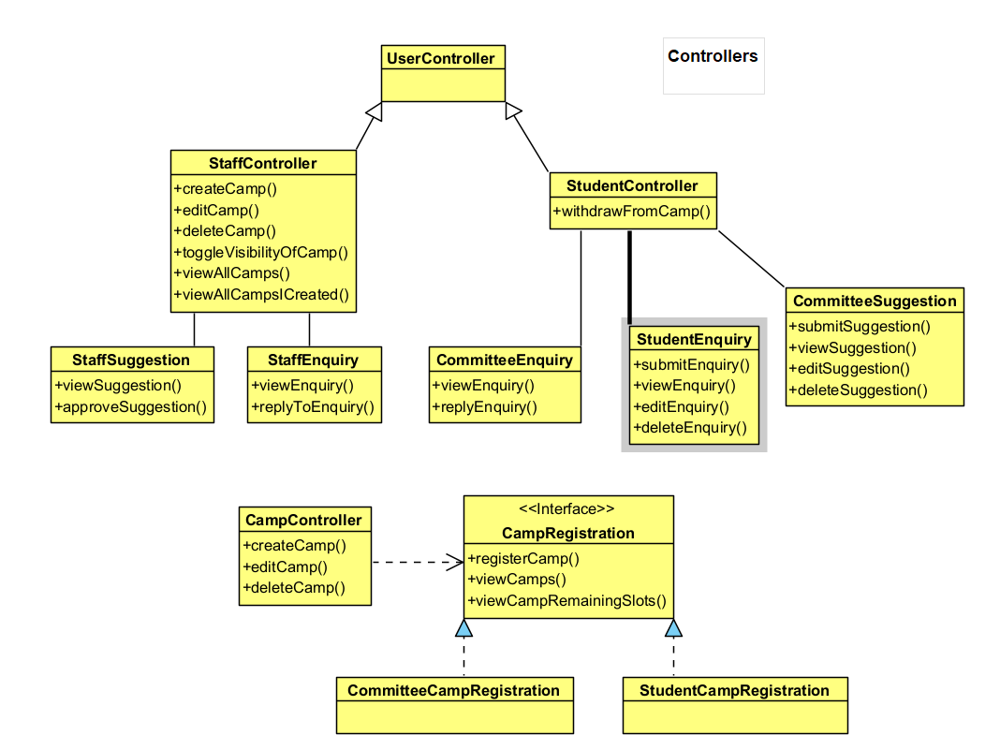
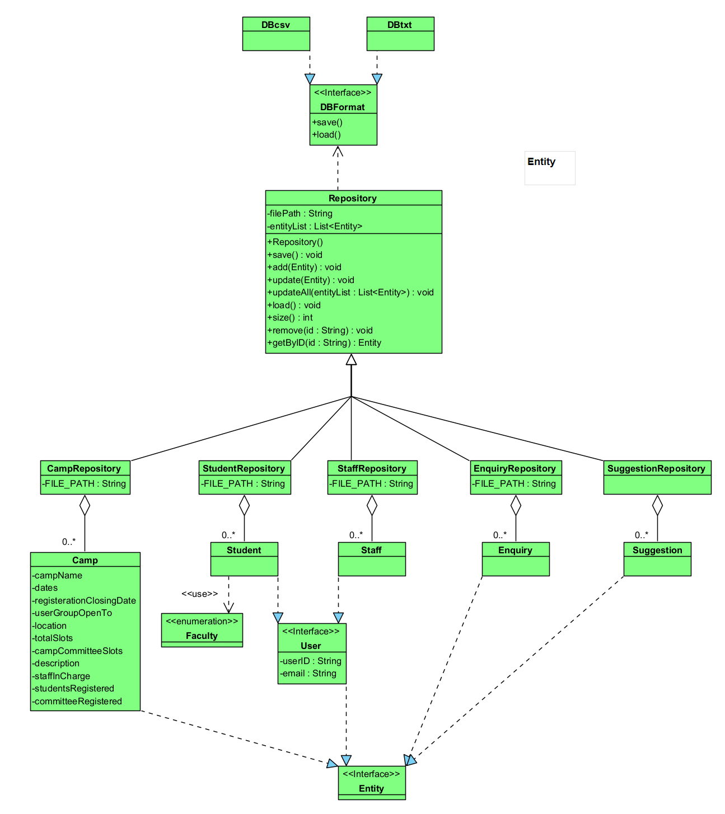

# OOP-Project
Building an OO Application on Camp Application and Management System (CAMs). CAMs is an application for staff and students to manage, view and register for camps within NTU. The application will act as a centralized hub for all staff and students.

---

To test out Repository go src/main/java/Main.java to run and test StudentRepository, CampController and CampRepository.

# UML Class Diagram

