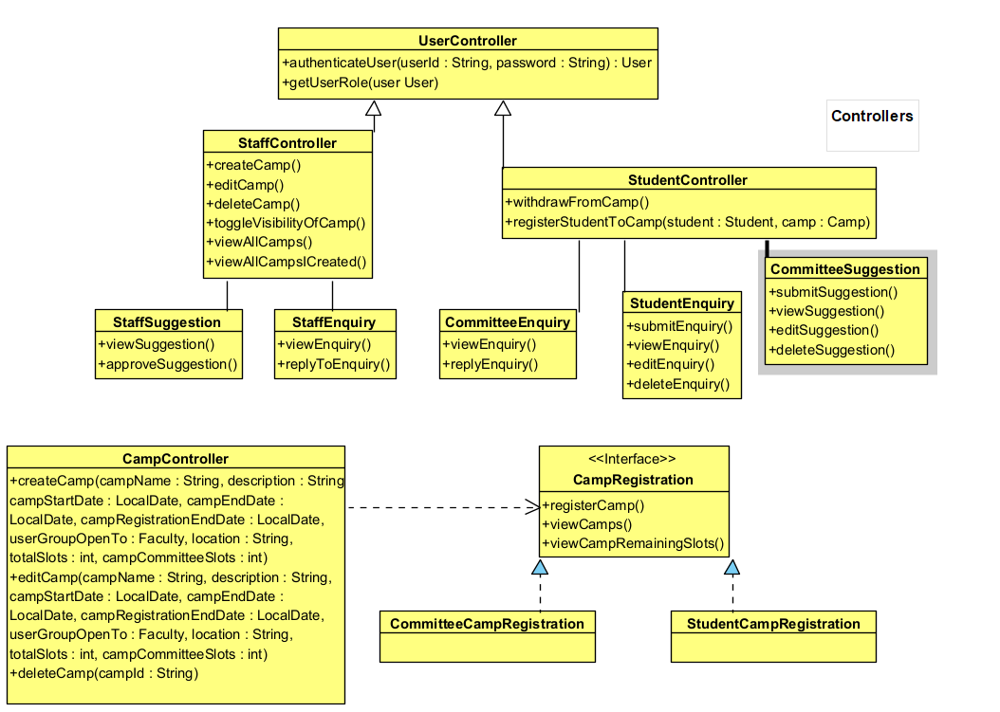
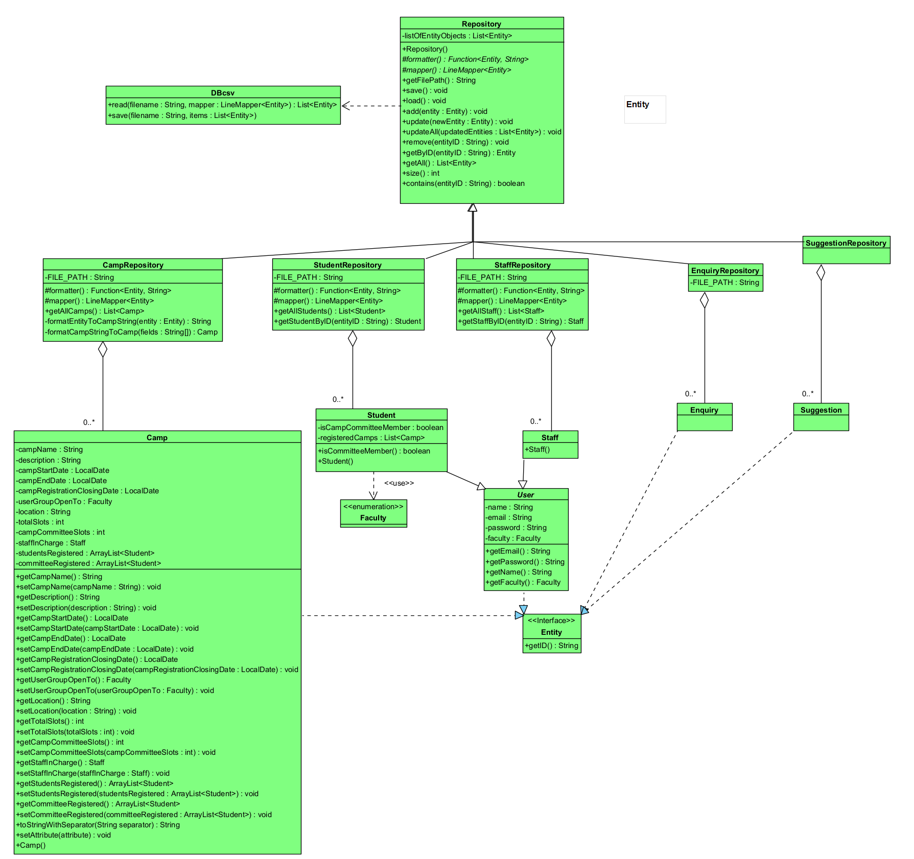

# OOP-Project
Building an OO Application on Camp Application and Management System (CAMs). CAMs is an application for staff and students to manage, view and register for camps within NTU. The application will act as a centralized hub for all staff and students.

The default password for every user is `password`.

---

testing git again to test branch

## Team Members

We are from Nanyang Technological University, Singapore. There are 4 members in our group:

| Name              | Github Account                                  | Email                                                     |
|-------------------|-------------------------------------------------|-----------------------------------------------------------|
| Ryan Sim Yao Rong | [RSYR1906](https://github.com/RSYR1906)| [ryan0041@e.ntu.edu.sg](mailto:ryan0041@e.ntu.edu.sg)     |
| Wonseok           | [wsklee](https://github.com/wsklee) | [wonseok001@e.ntu.edu.sg](mailto:@e.ntu.edu.sg)           |
| Zhi Yi            | [ii5ii](https://github.com/ii5ii) | [zzuo003@e.ntu.edu.sg](mailto:@e.ntu.edu.sg)              |
| Torrey            | [TorDij](https://github.com/TorDij)   | [tdijong001@e.ntu.edu.sg](mailto:tdijong001@e.ntu.edu.sg) |

## Features

- [x] Student
  - [x] View open camps
  - [x] Change my password
  - [x] View registered camps
  - [x] Submit camp enquiries
  - [x] Register for camp
  - [x] Withdraw from camp
  - [x] Check remaining slots
  - [x] Enquiry Management
        
- [x] Staff
  - [x] View all camps
  - [x] Change my password
  - [x] Manage camps (create/delete/edit)
  - [x] Toggle visibility of camps (on/off)
  - [x] Manage created camps
  - [x] Manage enquiries 
  - [x] Approve/Reject camp committee suggestions
  - [x] Generate attendees list
  - [x] Generate performance report

## UML Class Diagram

### Controller-Sub Diagram

### Entity-Sub Diagram

